# PokeAndScan — UI/UX Design Direction & Screen Audit

> Historical imported design exploration. Its recommendations, options, and file inventories include superseded material. For current product behavior and approved visuals, start at the [agent document router](../../../AGENTS.md) and [reference guide](../README.md).

**Version:** 0.4  
**Selected visual direction:** **Style 2 — Friendly Explorer**  
**Reference device:** Pixel 9 Pro XL, portrait  
**Platforms:** Android 10+  
**Languages:** Slovenčina / English  
**Themes:** Dark + Light  
**Status:** Design handoff / implementation guidance

**Revision note:** v0.4 extends v0.3 with refined logo directions for concepts 1 and 4, dedicated app icon iterations, and a compact brand/style-guide board.

---

## 0. What is locked in this revision

The selected visual direction is **Friendly Explorer**.

The app should feel:

- approachable but not childish;
- trustworthy before playful;
- clear and calm during long scanning/review sessions;
- Android-native enough to feel familiar;
- lightly gaming-adjacent without copying Pokémon GO;
- private and local by default;
- explicit whenever data is uncertain.

The visual language is built around:

- rounded, spacious surfaces;
- clear blue primary actions;
- soft sky-blue containers;
- limited violet and coral decorative accents;
- friendly abstract exploration illustrations;
- strong information hierarchy;
- semantic status chips with icon + label, never color alone;
- simple, reusable forms and cards instead of heavily custom widgets.

**Important:** generated concept images are visual references, not pixel-perfect production specifications. Copy, counts, iconography, and some example imagery in generated boards are illustrative only. This imported handoff is historical background; current project specifications are authoritative.

---

# 1. Product UX principles

## 1.1 Trust before delight

The app may feel friendly, but review accuracy and uncertainty must dominate over decoration.

The product should never visually imply that a value is known when it is not.

Use:

- `Unknown`;
- `Needs review`;
- `Partial`;
- missed-screen warnings;
- explicit provenance;
- original-vs-edited values.

Never silently substitute a likely value.

## 1.2 User remains in control

PokeAndScan:

- does not automate Pokémon GO;
- does not tap or swipe for the user;
- does not use game credentials/private APIs/root/overlays;
- does not upload scan data to a server;
- does not retain full source video;
- does not retain non-game screen images;
- captures screen video only, never microphone/system audio.

UI copy and illustrations must reinforce manual control rather than implying automation.

## 1.3 Evidence before decoration

Evidence crops are functional UI.

They may show source material from the user's own scan when needed for review, but **marketing illustrations, placeholders, icons, empty states, and generated mockups must not use Pokémon characters, official art, the Pokémon GO logo, Poké Ball artwork, or copied Pokémon GO UI styling.**

Use abstract scan/document/collection/exploration motifs instead.

## 1.4 Calm density

Friendly Explorer should not become an illustration-heavy app.

Illustrations are most useful for:

- onboarding;
- setup;
- empty states;
- first-run education;
- recovery guidance.

Data-heavy screens should become progressively more utilitarian:

- processing;
- active scan;
- summary;
- review;
- snapshot library;
- export.

---

# 2. Visual references

The following image files are included in this export folder.

## 2.1 Style comparison

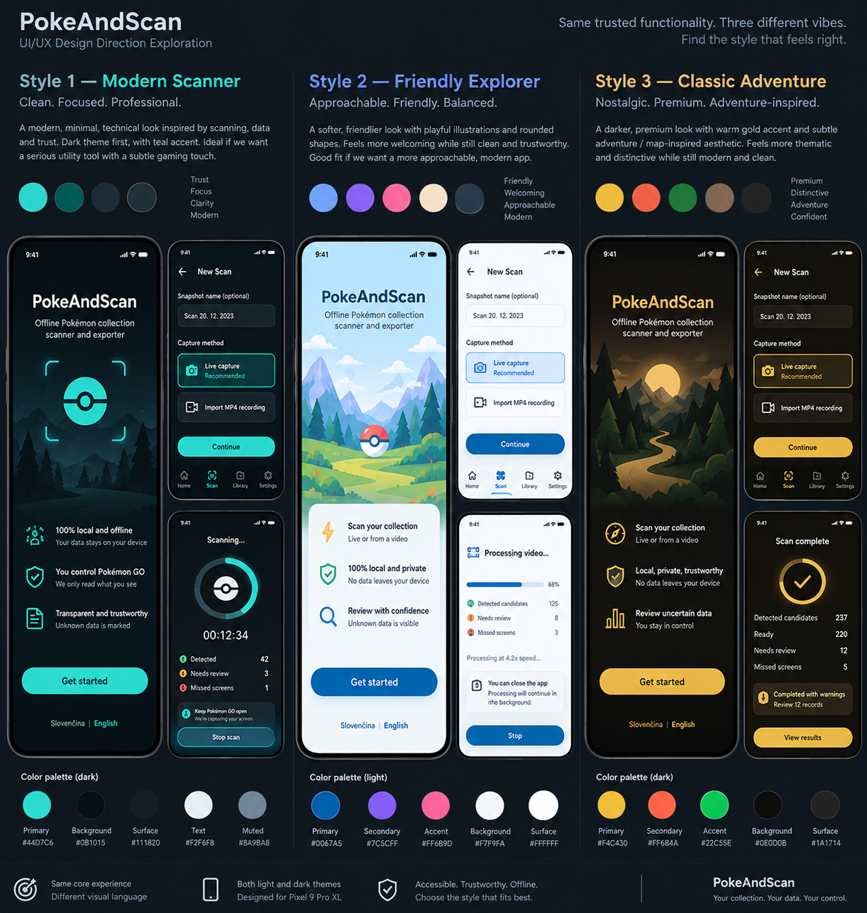

Use only as historical context showing why Friendly Explorer was selected.

## 2.2 Friendly Explorer foundation

Useful reference for:

- overall softness;
- blue-led palette;
- rounded cards;
- onboarding composition;
- new scan selection;
- processing hierarchy.

## 2.3 Friendly Explorer capture flow

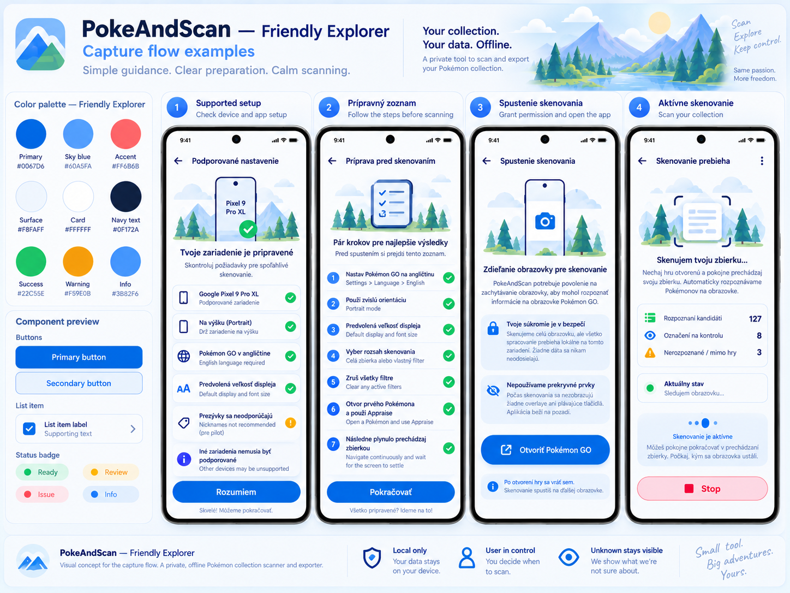

Useful reference for:

- setup cards;
- checklist rhythm;
- capture explanation;
- active scan structure.

## 2.4 Friendly Explorer review/results

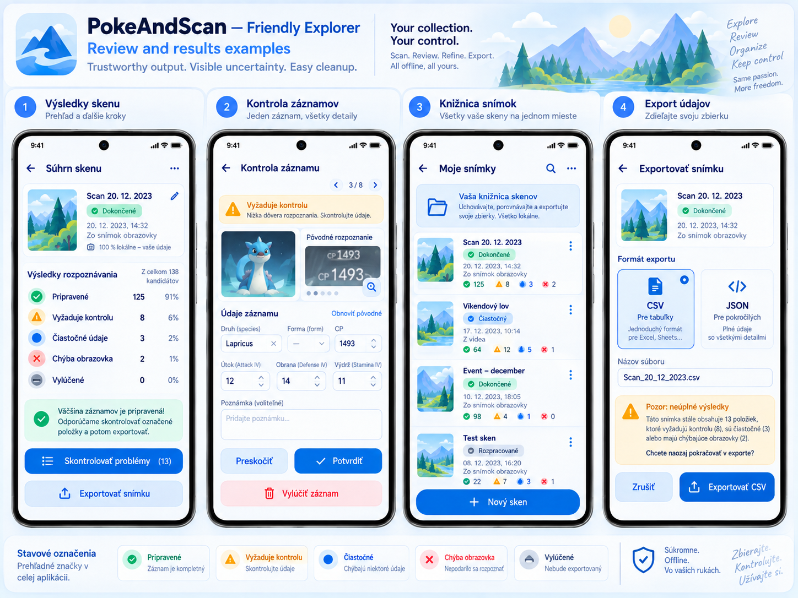

Useful reference for:

- summary hierarchy;
- review form density;
- snapshot library rhythm;
- export format cards.

### Reference-image caveats

The generated images contain several elements that **must not be copied literally**:

1. Pokémon/Poké Ball-like imagery may appear in concept art. Replace it with original abstract scan/collection/exploration graphics.
2. A character image may appear in the review mockup. Production placeholders must not use official Pokémon art. Real evidence crops from the user's own scan are a different case and are allowed only as review evidence.
3. Landscape thumbnails shown in the Snapshot Library are visually attractive but misleading because the product does not retain arbitrary screen images or the full source video. Replace them with abstract source/state icons or brand illustrations.
4. AI-generated text inside images may contain grammar, terminology, or numeric inconsistencies. Use current project specifications for product copy and behavior; this handoff is a visual reference only.
5. The current Friendly Explorer boards are primarily light-theme references. Dark theme is still required and is defined below as a first-class design.

---

# 3. Information architecture

## First run

`Language choice → Welcome → Capture explanation → Supported setup → Snapshot library`

The first-run education should not be repeated on every scan.

## Returning user

**Snapshot Library is the home screen.**

Top-level navigation recommendation:

- Snapshot Library = home;
- `New scan` = prominent primary action;
- Settings = app-bar action;
- no permanent 4-item bottom navigation.

### Why

A bottom bar containing Home + Scan + Library + Settings creates duplicate destinations and adds visual/navigation weight to a utility with only one true collection home.

During capture, processing, review, and export flows, hide global navigation and use a focused flow with standard back behavior where safe.

## Active-job rule

Only one capture/processing job may be active.

If a job exists:

- pin it at the top of Snapshot Library;
- show its current state and primary `Continue`/`View` action;
- disable or intercept `New scan`;
- explain why a second job cannot begin.

---

# 4. Color system — Friendly Explorer

## 4.1 Light theme

| Token | Hex | Usage |
|---|---:|---|
| `color.bg` | `#EEF4FF` | app background |
| `color.surface` | `#F8FAFF` | broad tonal sections |
| `color.card` | `#FFFFFF` | cards, forms, dialogs |
| `color.surfaceSubtle` | `#E7F0FF` | selected/educational containers |
| `color.textPrimary` | `#0F172A` | main copy |
| `color.textSecondary` | `#64748B` | secondary copy |
| `color.outline` | `#C9D7EA` | borders/dividers |
| `color.primary` | `#0067D6` | primary actions |
| `color.onPrimary` | `#FFFFFF` | content on primary |
| `color.primaryContainer` | `#DCEBFF` | selected option / info highlight |
| `color.onPrimaryContainer` | `#0B3A73` | text/icons on primary container |
| `color.secondary` | `#7C3AED` | limited secondary brand accent |
| `color.sky` | `#60A5FA` | illustration/brand accent |
| `color.coralDecorative` | `#FF6B6B` | decorative illustration accent only |

`#0067D6` with white is approximately 5.37:1 and is suitable for normal-size primary button text.

## 4.2 Dark theme

Dark remains a primary brand direction, not a simple inverted light theme.

| Token | Hex | Usage |
|---|---:|---|
| `color.bg` | `#0B1220` | app background |
| `color.surface` | `#111827` | cards / grouped surfaces |
| `color.surfaceRaised` | `#172033` | dialogs / raised cards |
| `color.surfaceSubtle` | `#162238` | selected/educational containers |
| `color.textPrimary` | `#F8FAFC` | main copy |
| `color.textSecondary` | `#CBD5E1` | secondary copy |
| `color.outline` | `#334155` | borders/dividers |
| `color.primary` | `#60A5FA` | primary actions / progress |
| `color.onPrimary` | `#0B1220` | content on primary |
| `color.primaryContainer` | `#16355B` | selected option / info highlight |
| `color.onPrimaryContainer` | `#DCEBFF` | content on primary container |
| `color.secondary` | `#A78BFA` | limited secondary accent |
| `color.coralDecorative` | `#FF7A7A` | decorative only |

The dark primary `#60A5FA` has strong contrast against `#0B1220` (~7.36:1).

## 4.3 Semantic states

Brand accents and semantic colors are separate.

### Light

| State | Foreground | Container |
|---|---:|---:|
| Ready / success | `#15803D` | `#DCFCE7` |
| Needs review / warning | `#B45309` | `#FEF3C7` |
| Partial / informational | `#1D4ED8` | `#DBEAFE` |
| Excluded / neutral | `#475569` | `#E2E8F0` |
| Missed / error | `#BE123C` | `#FFE4E6` |

### Dark

| State | Foreground | Container |
|---|---:|---:|
| Ready / success | `#4ADE80` | `#123522` |
| Needs review / warning | `#FBBF24` | `#3B2A08` |
| Partial / informational | `#93C5FD` | `#153255` |
| Excluded / neutral | `#CBD5E1` | `#243041` |
| Missed / error | `#FB7185` | `#4A1724` |

### Rules

- `coralDecorative` is **not** the error token.
- amber is for review/warnings;
- red/crimson is for errors, missed-screen issues, and permanent destructive confirmation;
- exclusion is reversible and should remain neutral;
- status always uses **icon + text + color**, never color alone.

---

# 5. Typography

Use the Android system / Material-compatible sans-serif stack for MVP.

Recommended practical implementation: Roboto/system sans.

| Role | Size | Weight |
|---|---:|---:|
| Large screen title | 28 sp | 700 |
| Screen title | 24 sp | 600–700 |
| Section title | 20 sp | 600 |
| Card title | 16–18 sp | 600 |
| Body | 16 sp | 400 |
| Supporting body | 14 sp | 400 |
| Label | 14 sp | 500–600 |
| Status badge | 12–14 sp | 600 |
| Large metric | 28–32 sp | 700 |

Rules:

- do not use novelty/game fonts;
- do not use all-caps for routine UI;
- numbers such as CP/IV should remain easy to scan;
- support Android font scaling;
- layouts must reflow rather than clip critical labels/actions.

---

# 6. Spacing, shape, elevation, touch

Use a 4 dp base grid.

| Token | Value |
|---|---:|
| `space.1` | 4 dp |
| `space.2` | 8 dp |
| `space.3` | 12 dp |
| `space.4` | 16 dp |
| `space.5` | 20 dp |
| `space.6` | 24 dp |
| `space.8` | 32 dp |
| `space.10` | 40 dp |

Default horizontal screen padding on the Pixel 9 Pro XL reference: **20 dp**.

| Shape token | Value |
|---|---:|
| `radius.small` | 8 dp |
| `radius.control` | 12 dp |
| `radius.card` | 16 dp |
| `radius.large` | 24 dp |
| `radius.pill` | 999 dp |

### Elevation

Prefer tonal hierarchy + 1 px outlines to large shadows.

- cards: 0–1 dp visual elevation;
- sticky CTA surfaces: subtle tonal separation;
- dialogs/bottom sheets: stronger tonal/elevation distinction;
- no floating glossy/glassmorphism aesthetic.

### Touch

Minimum interactive target: **48 × 48 dp**.

Primary button height: **52 dp** preferred.

---

# 7. Component system

## 7.1 Primary button

Use for exactly one dominant action in a view where practical.

Examples:

- Get started;
- Continue;
- Start capture;
- Confirm;
- Review issues;
- Export.

Filled blue, 52 dp, 12–14 dp corner radius.

## 7.2 Secondary button

Outlined or soft-blue tonal surface.

Examples:

- Import alternative;
- Skip;
- Finish partial snapshot;
- Cancel from a non-destructive dialog.

## 7.3 Destructive action

Do not make routine Stop or Exclude permanently red.

Use red emphasis for:

- Delete snapshot;
- Discard unrecoverable/unfinished data;
- destructive confirmation;
- processing failure state.

## 7.4 Choice card

Use for:

- Live capture vs Import MP4;
- CSV vs JSON;
- theme selection if represented visually.

Selected state:

- primary outline;
- light primary container;
- radio/check affordance;
- optional small `Recommended` badge.

## 7.5 Status chip

Compact pill with:

- icon;
- short label;
- semantic foreground/background.

Examples:

- ✓ Ready
- ! Needs review
- ◐ Partial
- – Excluded
- △ Missed appraisal

## 7.6 Info/warning card

Icon + heading + concise supporting text.

Do not place long legal copy inside colored alert boxes.

## 7.7 Metric row

Use a label + count, optionally with status icon.

Avoid percentage breakdowns that could be mistaken for a quality/confidence score unless the percentage has a concrete defined meaning.

## 7.8 Evidence crop

Evidence is not decorative.

- 12 dp corner radius;
- subtle outline;
- preserve useful aspect ratio;
- tap to expand where useful;
- no overlay gradients;
- do not crop out the evidence needed for the uncertain field;
- nearby UI distinguishes `Original detection` from current edited/confirmed values.

## 7.9 Record form

Field order is fixed:

1. species/form;
2. CP;
3. Attack IV;
4. Defense IV;
5. Stamina IV.

Use canonical species autocomplete/search.

IV inputs should use constrained numeric input.

`Unknown` must remain a valid visible state.

## 7.10 Sequence indicator

Because event order matters, use a recurring sequence indicator:

- `#042`;
- `3 of 8 issues`;
- missed event position.

This is especially valuable in review and manual-add flows.

---

# 8. State-model presentation

Do not invent a huge combined state enum.

## Snapshot lifecycle data

- `PROCESSING`
- `INCOMPLETE`
- `COMPLETE`

## Scope completeness

- `INTENDED_RANGE`
- `PARTIAL`

## Record status

- `READY`
- `NEEDS_REVIEW`
- `PARTIAL`
- `EXCLUDED`

## Warnings

Warnings are separate counts/types.

### User-facing derived labels

The UI may derive simple labels such as:

- Processing;
- Incomplete;
- Complete;
- Complete with warnings;
- Partial snapshot.

Do not store `Complete with warnings` as a new lifecycle state.

Missed appraisal screens are events/warnings, not Pokémon records.

---

# 9. Screen coverage audit

Current visual coverage against the 16-screen specification:

| # | Screen | Visual coverage | Notes |
|---:|---|---|---|
| 1 | Welcome / onboarding | ✅ Full concept | Foundation board |
| 2 | Capture explanation | ❌ Missing dedicated screen | Concepts are spread across onboarding/new scan |
| 3 | Supported setup | ✅ Full concept | Capture-flow board |
| 4 | New scan / snapshot setup | ✅ Full concept | Foundation board |
| 5 | Preparation checklist | ✅ Full concept | Capture-flow board |
| 6 | Live transition | ✅ Full concept | Capture-flow board |
| 7 | MP4 preflight + processing | ⚠️ Partial | Processing exists; dedicated preflight does not |
| 8 | Live active scan | ✅ Full concept | Capture-flow board |
| 9 | Interrupted processing recovery | ❌ Missing | Must be designed |
| 10 | Summary | ✅ Full concept | Review/results board |
| 11 | Review queue | ✅ Full concept | Review/results board |
| 12 | Manual add from missed event | ❌ Missing | Must be designed |
| 13 | Snapshot library | ✅ Full concept | Review/results board |
| 14 | Snapshot detail / record edit | ⚠️ Partial | Review editor can be reused; detail shell missing |
| 15 | Export | ✅ Full concept | Review/results board |
| 16 | Settings | ❌ Missing | Must be designed |

**Result:** 10 fully visualized, 2 partially visualized, 4 without a dedicated mockup.

This does not block implementation handoff because the behavior and layout guidance for all 16 screens is specified below.

---

# 10. UX/UI review by screen

## 10.1 Welcome / first-run onboarding

### Required content

- what the app does;
- local/offline promise;
- manual Pokémon GO control boundary;
- uncertainty/review promise;
- unofficial companion disclaimer.

### Recommended layout

Use a single vertically scrollable onboarding page rather than a multi-page carousel.

Structure:

1. small original Friendly Explorer illustration;
2. product title + descriptor;
3. three trust/value rows;
4. compact unofficial disclaimer;
5. language choice (`Slovenčina`, `English`);
6. primary `Get started`.

### Improvements from current mockup

- remove Poké Ball-like central brand mark;
- keep the landscape/exploration mood, but make the app mark abstract;
- reduce illustration height slightly so the first trust statement is visible without excessive scrolling;
- replace promotional wording with concrete behavior;
- keep disclaimer lower in hierarchy, but visible;
- do not request notification permission here.

### UX rationale

The user should understand privacy/control in under 10 seconds and continue without swiping through marketing slides.

---

## 10.2 Capture explanation

**Dedicated visual is currently missing.**

This is first-run education, not the actual scan-method selector.

### Recommended layout

Heading: `Two ways to scan`

Two explanatory cards:

**Live capture — Recommended**
- capture directly while the user manually uses Pokémon GO;
- whole device screen may be observed while MediaProjection is active;
- only Pokémon GO appraisal evidence is used for records;
- no microphone/system audio.

**Import MP4**
- choose an Android screen recording;
- processed locally;
- audio ignored.

Below:

- privacy/info card;
- `Continue` primary CTA;
- optional `Learn about screen capture` expandable text.

### Improvement

Do not ask the user to choose a mode on this educational screen. The actual choice belongs to `New scan`.

This avoids asking for the same decision twice.

---

## 10.3 Supported setup

### Recommended layout

Top card: reference profile.

Rows:

- Pixel 9 Pro XL reference;
- portrait;
- English Pokémon GO UI;
- default Android display size;
- default Android font size;
- no nicknames recommended for pilot.

### Improvements from current mockup

Do not display green checkmarks unless the app actually detected/verifies the condition.

Distinguish:

- `Reference requirement`;
- `Detected on this device`;
- `User must verify in Pokémon GO`.

Example:

`Pokémon GO language: English — Please verify`

Nickname recommendation should be amber advisory, not an error.

If the current device differs from the reference profile:

- show a non-destructive compatibility warning;
- explain that other devices may be unsupported;
- do not imply guaranteed failure before actual preflight where applicable.

CTA: `Continue`.

Optional secondary: `Check again`.

---

## 10.4 New scan / snapshot setup

### Fields

Snapshot name:

- optional;
- prefilled with localized default equivalent to `Scan <date>`;
- editable;
- not required.

Appraisal scope:

Use a simple choice:

- `Whole collection`;
- `Selected range / tag / filter`.

Do **not** ask for the tag name.

Capture method:

- Live capture — `Recommended`;
- Import MP4 recording.

### Improvements from current mockup

Add scope choice explicitly; it is missing from the visual.

If another capture/processing job is active:

- show a banner/card naming the active snapshot;
- primary action `Continue current job`;
- prevent starting another job.

The recurring scan flow should not include a bottom navigation bar.

Use one sticky `Continue` CTA.

---

## 10.5 Preparation checklist

### Recommended structure

Group content into two sections.

**Device / game setup**
- Pokémon GO language = English;
- portrait;
- default display/font;
- clear accidental filters.

**Collection navigation**
- choose whole collection or deliberate subset;
- sort by Name A→Z where practical;
- open first Pokémon;
- open Appraise;
- navigate continuously;
- wait for the appraisal screen to settle.

### Improvements from current mockup

Do not require seven manual checkbox taps unless they serve real validation.

Better approach:

- instructional rows;
- a single final confirmation: `I'm ready`;
- items the app can detect should show automatic state;
- user-controlled items remain instructions.

Mark `Sort by Name A→Z` as recommended, not mandatory.

Add short `Why?` affordances only where helpful.

Primary CTA stays sticky at bottom.

---

## 10.6 Live transition screen

### Required sequence

1. notification permission on first live start only, where Android requires it;
2. Android screen-capture consent;
3. explicit separate `Open Pokémon GO` button.

### Recommended UI

Use a simple 3-step state indicator.

Before MediaProjection consent:

- explain whole-screen observation;
- explicitly say no microphone/system audio;
- `Allow screen capture`.

After consent succeeds:

- replace the CTA with `Open Pokémon GO`;
- explain capture is active and the user must manually control the game.

### Notification-denied state

Non-blocking informational card:

`Live capture still works. Stop from the notification drawer is unavailable. You can stop from PokeAndScan or Android Task Manager.`

### Improvements from current mockup

The current screen visually combines explanation and launch well, but should more clearly separate **permission** from **Open Pokémon GO**.

Never imply PokeAndScan launches/navigates Pokémon GO automatically.

No overlays.

---

## 10.7 MP4 preflight and processing

**Processing is visualized; preflight is missing.**

### Preflight screen

Show:

- filename;
- duration;
- resolution;
- orientation;
- video track present;
- decoder availability;
- profile result.

Do not overwhelm with codec details by default. Put technical metadata under `Details`.

### Profile result states

**Supported**
- primary CTA `Process recording`.

**Supported with deviations**
- persistent amber warning;
- explain which deviation was found;
- allow processing.

**Unsupported**
- clear reason;
- no processing CTA;
- `Choose another file`.

### Processing screen

Show:

- determinate progress based on video position;
- current stage;
- detected candidates;
- review issues;
- missed-screen warnings;
- `Stop`/`Cancel`;
- background-processing explanation.

### Improvements from current mockup

Remove processing-speed decoration such as `4.2×` unless it has real diagnostic value.

Do not add Pause.

Notification permission is not mandatory for MP4 processing.

If optional progress notification is unavailable/denied, processing still proceeds where Android permits.

---

## 10.8 Live active scan

### Important UX reality

While the user is inside Pokémon GO, this app screen is not visible.

Therefore the active-scan screen is primarily:

- what the user sees when returning to PokeAndScan;
- a status/recovery surface;
- not the main live guidance mechanism.

Do not compensate with overlays.

### Recommended content

- `Capture active`;
- elapsed time;
- detected candidate count;
- review count;
- missed/non-game warning count;
- current parser state;
- Stop.

Current-state examples:

- `Waiting for appraisal screen`;
- `Appraisal screen settling`;
- `Candidate captured`;
- `Pokémon GO not visible — frame ignored`.

### Improvements from current mockup

Do **not** show a percentage; range length is unknown.

Make warnings non-blocking.

Use a neutral/outlined `Stop` treatment rather than permanent destructive red because stopping should lead to a controlled partial/summary flow rather than imply immediate deletion.

Foreground-service notification, when available, should carry the persistent capture state and Stop action.

---

## 10.9 Interrupted processing recovery

**Dedicated visual is missing.**

Show this after the user opens the app and a previous processing job was interrupted.

### Layout

Header:

`Processing was interrupted`

Context card:

- snapshot name;
- source type/file;
- last saved progress;
- candidates already retained;
- review/missed counts.

Actions in this hierarchy:

1. **Continue processing** — primary;
2. **Finish partial snapshot** — secondary;
3. **Discard** — destructive tertiary.

### Rules

- never resume automatically;
- explain that `Finish partial snapshot` keeps trustworthy processed results and marks scope as partial;
- if the source is no longer available, disable `Continue processing` and explain why;
- confirmation is required for `Discard`.

---

## 10.10 Summary

### Required counts

- candidate count;
- ready count;
- partial count;
- review count;
- missed-screen count;
- excluded count.

### Recommended hierarchy

Top:

- snapshot name;
- user-facing lifecycle label;
- scope-completeness label.

Then split into:

**Records**
- Candidates;
- Ready;
- Needs review;
- Partial;
- Excluded.

**Warnings**
- Missed appraisal screens;
- other warning counts.

### Improvements from current mockup

Avoid percentages next to Ready/Review/Partial unless they are explicitly useful. Counts are clearer and less likely to look like confidence scores.

Primary CTA:

- if unresolved review exists: `Review issues (N)`;
- if no review issues: `Export`.

Secondary action:

- `Export` is still available when appropriate, with warning behavior preserved.

Do not merge warning state into the stored lifecycle enum.

---

## 10.11 Review queue

### Recommended structure

Top app bar:

- `Review`;
- `3 of 8`;
- sequence `#042`.

Issue banner:

- concise reason;
- field(s) requiring review.

Evidence:

- one evidence crop;
- tap to expand;
- no decorative character artwork.

Form:

1. Species;
2. Form;
3. CP;
4. Attack IV;
5. Defense IV;
6. Stamina IV.

Actions:

- `Confirm` primary;
- `Skip` secondary;
- `Reset to original detection` text action when available;
- `Exclude record` lower-emphasis reversible action.

### Improvements from current mockup

The current mockup uses too much space for a character/image example and does not emphasize the sequence enough.

Show original detection at field level where useful, for example:

`Detected: 1493`

If a field was already trusted, avoid making the user re-enter it.

On `Skip`, move to the next issue and keep the current item unresolved.

On `Exclude`, use a snackbar `Record excluded — Undo` rather than a destructive modal.

Excluded records can later be restored.

---

## 10.12 Manual add from missed event

**Dedicated visual is missing.**

Use the same record-form component as review/edit, but with different context.

### Header

`Add missed Pokémon`

Show:

- missed-event sequence position;
- optional event time;
- provenance badge `Manually added`.

### Form

- Species — required canonical dictionary;
- Form — if applicable;
- CP — optional;
- Attack IV — optional;
- Defense IV — optional;
- Stamina IV — optional.

Empty numeric fields become `Unknown`.

### UX copy

Explain once:

`Only enter values you know. Empty fields will remain Unknown.`

### Actions

- `Add record` primary;
- `Cancel` secondary.

Cancel leaves the missed-screen warning unresolved.

The new record is inserted at the missed event's sequence position.

---

## 10.13 Snapshot library

### Recommended card/list content

- snapshot name;
- date/time;
- source type: Live / MP4;
- lifecycle display label;
- scope completeness;
- compact counts for review/partial/warnings;
- active-job progress where applicable.

### Improvements from current mockup

**Remove screenshot/landscape thumbnails.**

They incorrectly suggest retained media.

Instead use:

- abstract scan icon;
- live/video source icon;
- small Friendly Explorer decorative symbol;
- status-tinted abstract tile.

Snapshot cards should not imply a merged master collection.

Each card is clearly independent.

Actions in overflow:

- Rename;
- Edit;
- Export;
- Delete snapshot.

Tap card → Snapshot detail.

`New scan` remains the dominant floating/sticky action.

If an active job exists, pin it above completed snapshots.

---

## 10.14 Snapshot detail / record edit

**Only partially visualized.**

### Snapshot detail shell

Header:

- snapshot name;
- source;
- date/time;
- lifecycle label;
- scope completeness.

Summary row:

- candidate;
- ready;
- review;
- partial;
- missed;
- excluded.

Then record list with lightweight filters:

- All;
- Needs review;
- Partial;
- Excluded.

Avoid introducing complex collection-management features beyond MVP.

### Record row

- sequence;
- canonical species/form or Unknown;
- CP or Unknown;
- IV summary where available;
- status chip.

Tap → Record edit.

### Record edit

Reuse the review editor component but without queue navigation.

Show:

- evidence crop;
- current values;
- original detection;
- provenance;
- `Reset to original detection` where possible;
- Exclude/Restore.

### Improvements

Do not build a completely separate edit form.

One shared record editor reduces UX inconsistency and implementation complexity.

For manually added records, `Reset to original detection` is unavailable and should not appear disabled without explanation.

---

## 10.15 Export

### Recommended top section

Snapshot identity + status summary.

Format cards:

**CSV**
- rows only;
- literal `UNKNOWN`;
- excluded records omitted.

**JSON**
- records + snapshot metadata;
- lifecycle;
- scope completeness;
- warning counts;
- missed-appraisal events;
- `null` for unknown values;
- excluded records omitted.

### Improvements from current mockup

Do not describe JSON merely as `for advanced users`; explain the actual difference.

Show:

`Exported field names/content are always English.`

Filename:

- preview derived from snapshot name;
- final Save/Share destination may allow Android to resolve/rename it.

### CSV unresolved-warning behavior

If unresolved issues or gaps remain and CSV is selected:

- show an amber warning immediately above export CTA;
- allow the user to continue;
- do not silently suppress records or fill guesses.

Use Android Save/Share flow rather than a custom destination browser.

---

## 10.16 Settings

**Dedicated visual is missing.**

Use a simple grouped settings list.

### Language

Heading: `Language`

Radio options only:

- `Slovenčina`;
- `English`.

No `System default`.

Apply immediately.

### Theme

- `System default`;
- `Light`;
- `Dark`.

### About and privacy

Opens a detail page containing:

- offline/local processing explanation;
- capture boundary;
- no game credentials/private APIs/root/overlays;
- source-retention explanation;
- unofficial companion disclaimer;
- app version.

### Developer diagnostics

Place under a visibly lower-priority `Advanced` section.

Diagnostics should remain local unless the user explicitly saves/shares them.

Do not imply automatic diagnostic upload.

---

# 11. Additional global UX improvements

## 11.1 Terminology consistency

Pick one Slovak term and use it consistently for each concept.

Recommended:

- Scan = `Sken`;
- Snapshot = `Snímka` only if it does not sound like an image screenshot in user testing.

Because `snímka` can imply a picture, consider using **`Sken` as the primary user-facing noun** and reserving `snapshot` for internal/domain terminology.

Example:

- `Moje skeny`;
- `Nový sken`;
- `Detail skenu`;
- `Exportovať sken`.

This better matches the product mental model and avoids implying saved screenshots.

## 11.2 Avoid false media-retention cues

Do not show:

- screenshot thumbnails in library;
- video posters that look permanently stored;
- galleries of source frames.

Evidence crops should appear only where needed for a specific record/review.

## 11.3 No fake certainty

Do not use generic green `Complete` when unresolved warnings remain without also exposing the warning state.

Use the derived display label `Complete with warnings`.

## 11.4 One primary action

Especially on mobile, each screen should visually prioritize one next step.

Secondary/reversible actions remain available but quieter.

## 11.5 Confirmation policy

Require confirmation for:

- Delete snapshot;
- Discard interrupted job;
- unrecoverable cancel if data would be lost.

Avoid confirmation for:

- Skip review;
- Exclude record;
- Restore record.

Use Undo/snackbar where possible for reversible actions.

---

# 12. Accessibility

## Contrast

Target WCAG AA or stronger for text and meaningful controls.

Do not place medium-light blue text on white without checking contrast.

## Color-independent status

All status semantics require:

- icon;
- text;
- optional color.

## Dynamic text

Critical actions and values must reflow.

Do not truncate:

- species;
- status;
- warning meaning;
- primary action.

## Touch

Minimum 48 dp.

## Motion

Friendly Explorer can use subtle motion, but no required meaning depends on animation.

Recommended:

- short progress transitions;
- subtle check/status transition;
- optional gentle active-capture pulse.

Respect reduced-motion settings where available.

## Evidence

Any evidence crop must be accompanied by text describing the issue being reviewed. The crop alone must never be the only explanation.

---

# 13. Illustration and icon rules

## Illustration

Use original, generic exploration metaphors:

- mountains;
- trail;
- compass;
- scan frame;
- stacked cards;
- abstract collection tiles;
- document/search symbols.

Do not use:

- Pokémon characters;
- Poké Balls;
- Pokémon GO logos;
- recognizable copied game landscapes/UI;
- fan-art approximations of official characters.

## Icons

Prefer Material Symbols or a consistent Android-native icon family.

Use custom icons only for the brand mark if necessary.

Do not mix multiple icon weights/styles.

---

# 14. Light vs dark theme behavior

Do not simply invert.

## Light

- airier;
- more visible pale-blue grouping;
- white cards;
- illustrations can use more sky and landscape tones.

## Dark

- reduce large illustration coverage;
- use deep navy surfaces;
- primary blue becomes lighter;
- use outlines/tonal elevation instead of heavy shadows;
- keep warning/error containers dark and low-saturation;
- evidence crops may naturally sit well against the darker surface.

A dedicated dark-theme visual pass is still recommended because the current selected-style mockups are mostly light.

---

# 15. Component inventory for implementation

Reusable components:

- `TopAppBar`;
- `PrimaryButton`;
- `SecondaryButton`;
- `ChoiceCard`;
- `StatusChip`;
- `InfoCard`;
- `WarningCard`;
- `MetricRow`;
- `SnapshotCard`;
- `ActiveJobCard`;
- `ProgressBlock`;
- `StageLabel`;
- `EvidenceCrop`;
- `SequenceIndicator`;
- `RecordStatusRow`;
- `RecordEditor`;
- `CanonicalSpeciesField`;
- `OptionalNumericField`;
- `OriginalDetectionRow`;
- `MissedEventCard`;
- `ExportFormatCard`;
- `ConfirmDestructiveDialog`;
- `UndoSnackbar`;
- `EmptyStateIllustration`;
- `SettingsRow`.

Shared components should drive both light and dark themes through tokens, not hardcoded per-screen colors.

---

# 16. Critical copy rules

Tone:

- calm;
- concise;
- factual;
- not alarmist;
- not overly cute.

Prefer:

`We couldn't confirm the species.`

over:

`Oops! Something went wrong!`

Prefer:

`This frame was outside Pokémon GO and was ignored.`

over:

`Invalid frame detected.`

Prefer:

`Only enter values you know.`

over:

`Please complete all fields.`

The UX should reward honesty about unknowns, not pressure users to fill missing values.

---

# 17. Recommended next visual pass

The next design iteration should create dedicated high-fidelity Friendly Explorer visuals for the currently uncovered states:

1. Capture explanation;
2. MP4 preflight;
3. Interrupted processing recovery;
4. Manual add from missed event;
5. Snapshot detail + record edit;
6. Settings;
7. full dark-theme pass for core happy path.

Priority order:

`Interrupted recovery → Manual add → MP4 preflight → Snapshot detail/edit → Settings → Capture explanation → dark-theme board`

The first four have the highest risk of implementation ambiguity.

---

# 18. Final design direction

**Friendly Explorer is the selected product direction.**

The strongest form of this direction is not “cute gaming UI.” It is:

> **A clear Android utility with a friendly exploration layer.**

The product should become more visually restrained as the user moves from onboarding into evidence-heavy work.

The final hierarchy is:

**friendly entry → clear preparation → calm capture → transparent processing → evidence-first review → trustworthy export**

That hierarchy should remain more important than decorative consistency with any generated concept board.

---

# 19. v0.3 update — newly generated reference boards

The following additional visuals are now part of the reference pack and should be considered when implementing or refining the design.

## 19.1 Additional UI boards

### 05. Capture explanation + MP4 processing
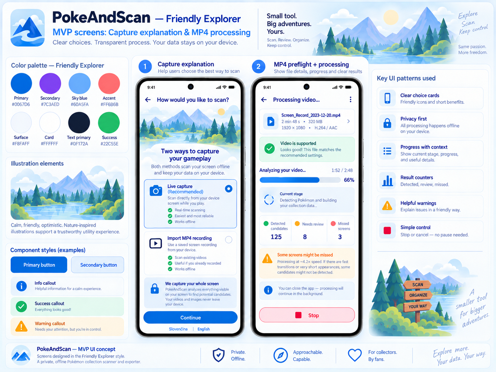

Purpose:
- fills the gap for the dedicated `Capture explanation` screen;
- adds a clearer `MP4 preflight + processing` concept;
- reinforces friendly explanation cards and clear progress hierarchy.

### 06. Recovery, manual add, settings
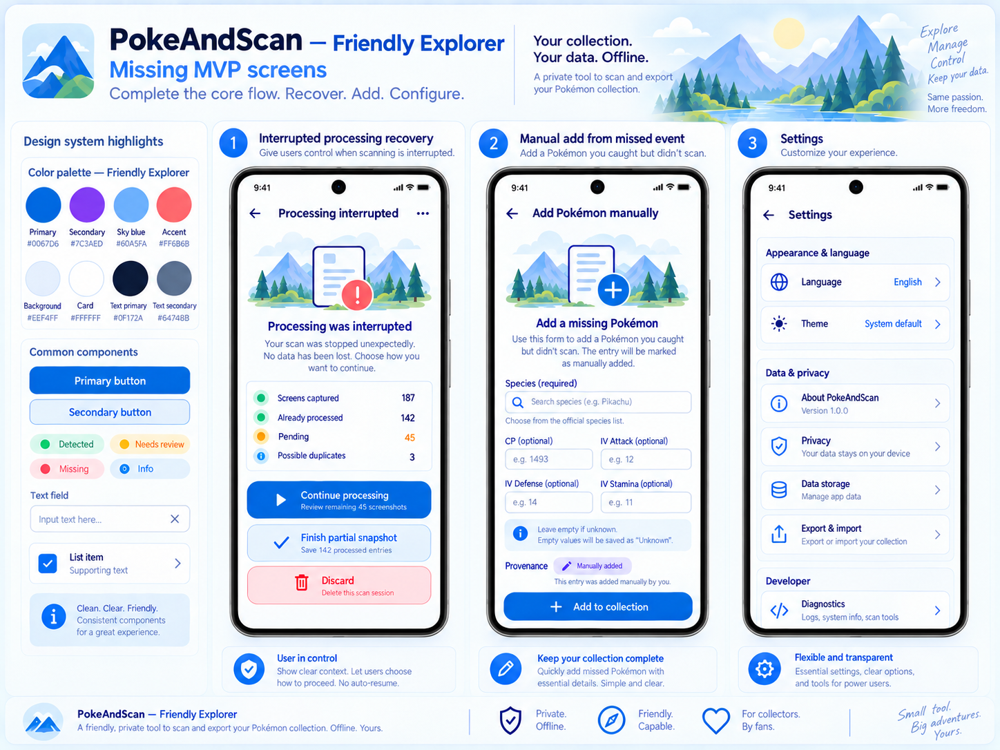

Purpose:
- covers the previously missing states:
  - interrupted processing recovery;
  - manual add from missed event;
  - settings.

### 07. Snapshot detail + record edit
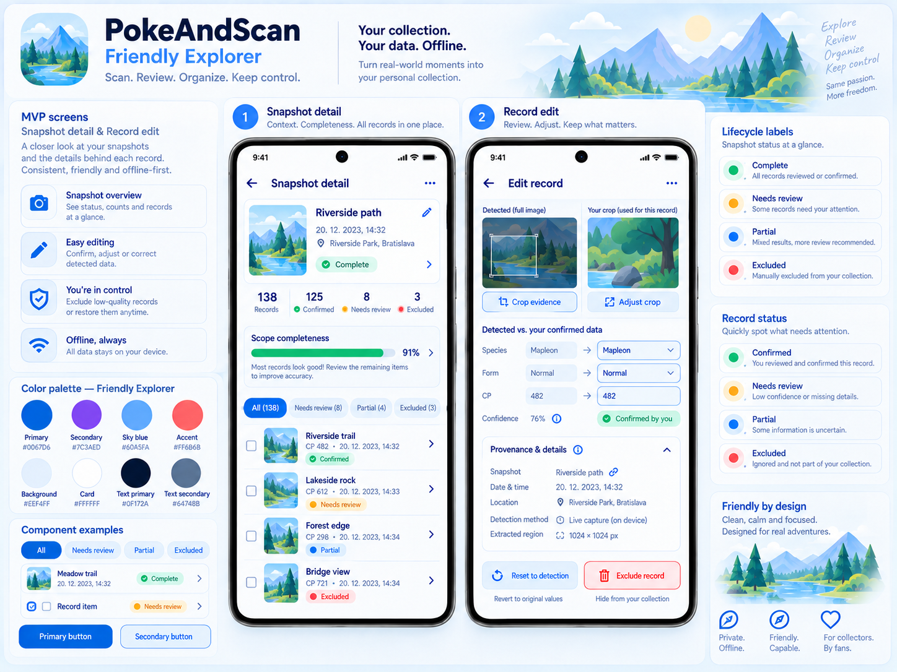

Purpose:
- provides the missing dedicated visual for:
  - snapshot detail shell;
  - record edit;
  - lifecycle/status presentation;
  - evidence + editable record structure.

## 19.2 Dark-theme boards

### 08. Dark theme — core flow
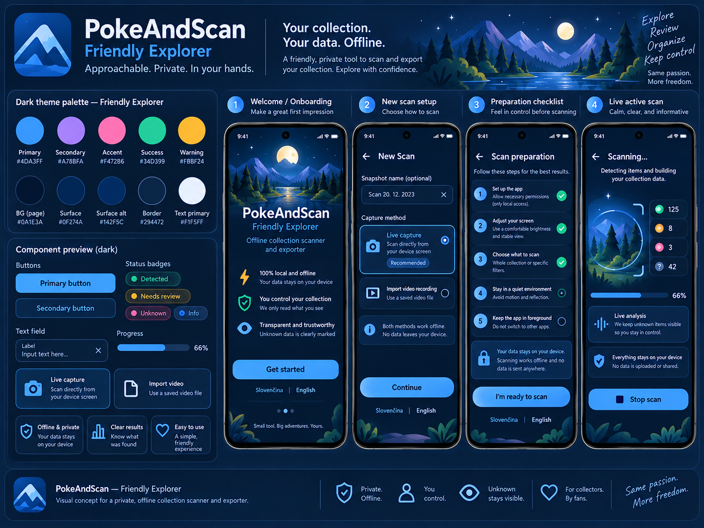

Covers:
- onboarding;
- new scan;
- preparation checklist;
- live active scan.

### 09. Dark theme — results flow
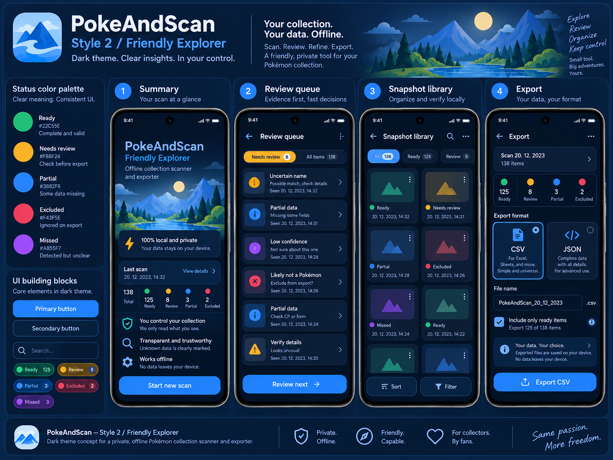

Covers:
- summary;
- review queue;
- snapshot library;
- export.

### Dark-theme implementation note

These two boards move the Friendly Explorer style in the right direction, but they are still reference artwork, not production-perfect specifications. Use them mainly for:

- contrast balance;
- surface hierarchy;
- dark semantic colors;
- illustration restraint;
- button/chip treatment in low-light UI.

Do not copy any placeholder record thumbnails or decorative content too literally.

## 19.3 Nature / illustration moodboard

### 10. Nature illustration moodboard
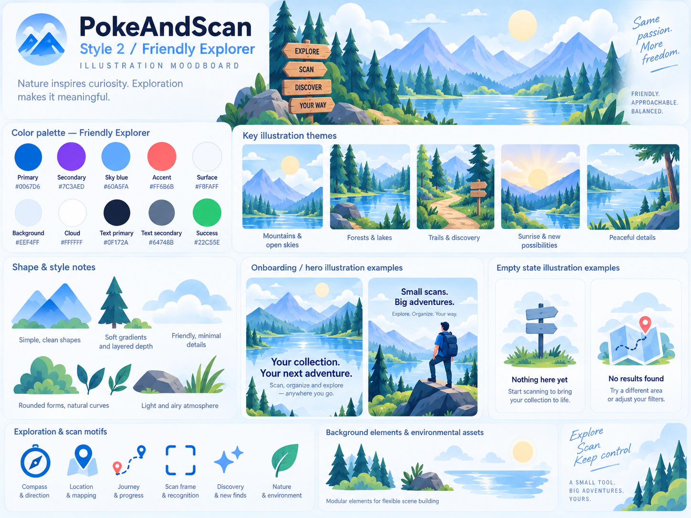

This board should guide:
- onboarding hero scenes;
- empty states;
- contextual illustrations;
- background/environment art fragments;
- overall emotional tone.

### Illustration direction now clarified

Friendly Explorer illustrations should use:

- calm mountain/lake/forest scenes;
- paths, signposts, discovery motifs;
- soft gradients;
- rounded, simplified forms;
- airy light atmosphere;
- limited detail density.

Illustrations should **not** be used as dense content behind forms or metrics. Keep data surfaces clean.

---

# 20. Nature reference guidance

The `10_nature_illustration_moodboard.png` file is now the primary visual reference for nature-inspired assets.

## 20.1 Key themes

Recommended recurring themes:

1. **Mountains + open sky**  
   communicates horizon, confidence, clarity.

2. **Forests + lakes**  
   communicates calm, privacy, and gentle exploration.

3. **Trails + signposts**  
   communicates user-guided progress and intentional navigation.

4. **Sunrise / light on landscape**  
   communicates optimism and discovery without looking childish.

5. **Peaceful micro-details**  
   rocks, leaves, grass tufts, clouds, tree silhouettes.

## 20.2 Use cases

Use these assets on:

- onboarding;
- empty states;
- summary hero cards;
- section headers in educational screens;
- settings/about/privacy pages;
- splash/app-store style presentation art.

Avoid using large scenic art on:

- review queue;
- heavy data-entry screens;
- export form;
- active scan control surfaces.

## 20.3 Motif vocabulary

Preferred motifs:
- compass;
- path/trail;
- map marker;
- scan frame;
- discovery sparkle;
- leaf/nature detail;
- layered mountains;
- lake reflection.

Avoid:
- fantasy creatures;
- copied franchise scenery;
- adventure gear that shifts the app toward hiking-tool branding too strongly;
- over-detailed landscapes behind text.

---

# 21. Logo and app icon direction

### 11. Logo + app icon exploration
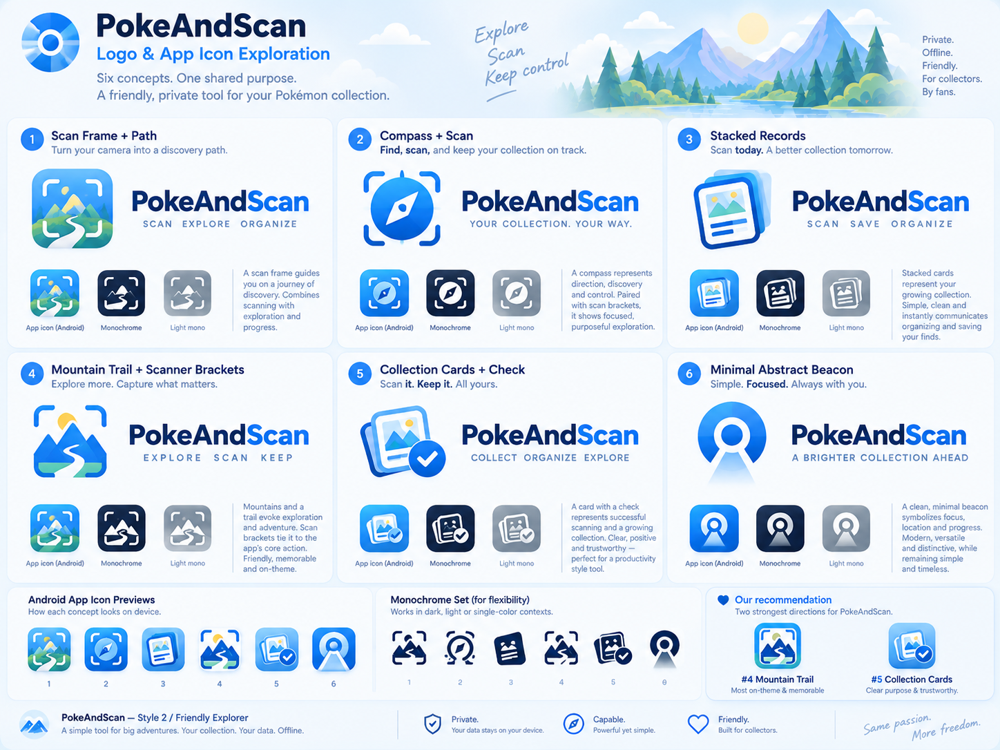

User preference ranking from the current exploration:

1. **Concept 1 — Scan Frame + Path** (**preferred**)
2. **Concept 4 — Mountain Trail + Scanner Brackets** (**backup / secondary favorite**)

## 21.1 Preferred direction — Concept 1

**Concept 1: Scan Frame + Path**

Why it works:
- directly combines the two strongest product meanings:
  - scanning/capture;
  - guided exploration/progress.
- fits the Friendly Explorer brand better than a purely technical or purely abstract mark;
- works naturally as both an app icon and a broader brand symbol;
- gives room for a recognizable small-size Android icon.

Recommended refinement for production:
- simplify the path shape slightly for legibility at small sizes;
- keep the scan brackets bold enough to survive favicon/app-icon sizes;
- reduce internal detail in the mountain/landscape layers if needed;
- test a flatter version for monochrome use.

## 21.2 Secondary direction — Concept 4

**Concept 4: Mountain Trail + Scanner Brackets**

Why it works:
- strongest “on-theme” mountain identity;
- memorable silhouette;
- cleaner, more emblem-like structure than some of the other concepts;
- good backup if we want a more iconic and less scenic symbol.

Trade-off:
- slightly less explicit about “scan/export/record” than concept 1;
- may lean more toward exploration/trail than collection/data.

Recommended use:
- keep as the secondary logo route if concept 1 becomes too detailed at small sizes;
- also useful as a variant for marketing badges or decorative brand stamps.

## 21.3 Rejected / lower-priority directions

At this stage, concepts 2, 3, 5, and 6 should be treated as secondary exploration only.

General reasons:
- either less distinctive;
- or less aligned with the chosen Friendly Explorer narrative;
- or less balanced between scanning + collection + exploration.

## 21.4 Recommended next logo step

The next branding iteration should focus only on:
- **Concept 1**
- **Concept 4**

For each, prepare:
1. full-color app icon;
2. monochrome icon;
3. wordmark lockup;
4. simplified small-size Android launcher test;
5. dark-background and light-background previews.

Current recommendation:
- **Primary route:** Concept 1
- **Fallback / alternate:** Concept 4

---

# 22. Updated screen-coverage status

After the new visual boards, practical screen coverage is now:

| # | Screen | Coverage after v0.3 | Notes |
|---:|---|---|---|
| 1 | Welcome / onboarding | ✅ Visualized | light + dark references |
| 2 | Capture explanation | ✅ Visualized | dedicated board added |
| 3 | Supported setup | ✅ Visualized | existing capture-flow board |
| 4 | New scan / snapshot setup | ✅ Visualized | light + dark references |
| 5 | Preparation checklist | ✅ Visualized | light + dark references |
| 6 | Live transition | ✅ Visualized | existing reference sufficient |
| 7 | MP4 preflight + processing | ✅ Visualized | dedicated concept added |
| 8 | Live active scan | ✅ Visualized | light + dark references |
| 9 | Interrupted processing recovery | ✅ Visualized | dedicated concept added |
| 10 | Summary | ✅ Visualized | light + dark references |
| 11 | Review queue | ✅ Visualized | light + dark references |
| 12 | Manual add from missed event | ✅ Visualized | dedicated concept added |
| 13 | Snapshot library | ✅ Visualized | light + dark references |
| 14 | Snapshot detail / record edit | ✅ Visualized | dedicated concept added |
| 15 | Export | ✅ Visualized | light + dark references |
| 16 | Settings | ✅ Visualized | dedicated concept added |

**Result:** all 16 required MVP screens now have visual reference coverage.

---

# 23. File inventory in this export pack

## Core handoff
- `PokeAndScan_UIUX_Design_Handoff_v0.3.md`

## Earlier exploration
- `01_style_comparison_board.png`
- `02_friendly_explorer_foundation_light.png`
- `03_capture_flow_light.png`
- `04_review_library_export_light.png`

## Newly added UI boards
- `05_capture_explanation_and_mp4_processing.png`
- `06_recovery_manual_add_settings.png`
- `07_snapshot_detail_and_record_edit.png`

## Dark-theme references
- `08_dark_theme_core_flow.png`
- `09_dark_theme_results_flow.png`

## Visual/brand references
- `10_nature_illustration_moodboard.png`
- `11_logo_and_app_icon_exploration.png`

## Archive
- `archive_PokeAndScan_UIUX_Brainstorm_v0.1.md`
- `archive_PokeAndScan_UIUX_Design_Handoff_v0.2.md`

---

# 24. Final note

Friendly Explorer is now sufficiently defined across:

- visual style;
- all required MVP screens;
- light and dark directions;
- illustration language;
- early brand/logo exploration.

If a next step is needed after this package, the highest-value move would be to create a **tightened brand iteration for logo concept 1 and 4** and then a **clean implementation-ready component spec** (states, spacing, tokens, component anatomy) derived from the boards in this pack.

---

# 25. v0.4 update — brand refinement, app icons, and mini brand pack

This revision adds a more implementation-oriented brand layer on top of the UI direction.

New files in this pack:

- `12_logo_refinement_primary_vs_secondary.png`
- `13_app_icon_iterations.png`
- `14_mini_brand_pack_style_guide.png`

These boards should be used together with the v0.3 moodboard and logo exploration board.

## 25.1 Refined logo comparison

### 12. Logo refinement — primary vs secondary
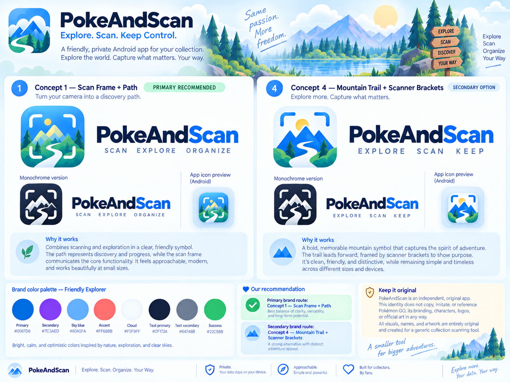

This board narrows the identity decision down to the two selected routes:

- **Concept 1 — Scan Frame + Path** → primary recommendation
- **Concept 4 — Mountain Trail + Scanner Brackets** → strong secondary option

### Final preference status

Confirmed by current review:

1. **Primary brand route:** Concept 1 — Scan Frame + Path
2. **Secondary / fallback route:** Concept 4 — Mountain Trail + Scanner Brackets

## 25.2 App icon iterations

### 13. App icon iterations
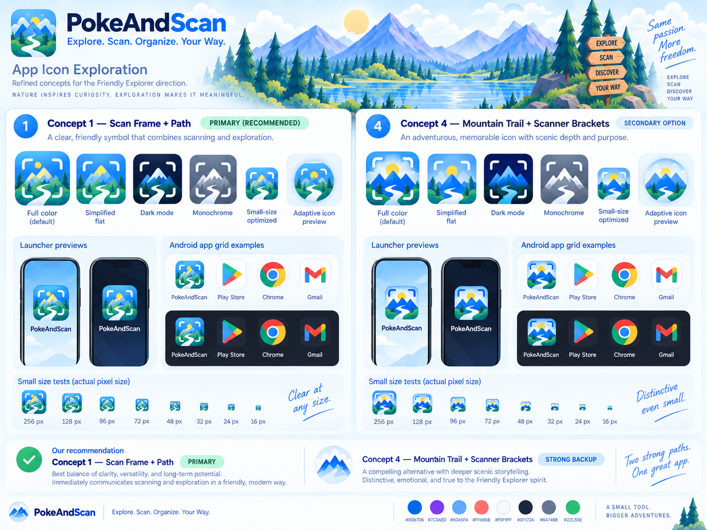

This board explores:

- full-color default icon;
- simplified flat variant;
- dark-mode icon;
- monochrome version;
- small-size-optimized variant;
- adaptive icon preview;
- launcher previews;
- Android grid examples;
- small-size legibility checks.

### App icon direction

If only one icon route is implemented first, it should be:

**Concept 1 — Scan Frame + Path, full-color default**, with:
- simplified flat backup;
- dark-mode version;
- monochrome version.

Concept 4 remains a valuable alternative, but it should not split the first implementation unless there is a specific need for multiple campaign identities.

## 25.3 Mini brand pack / style guide

### 14. Mini brand pack / style guide
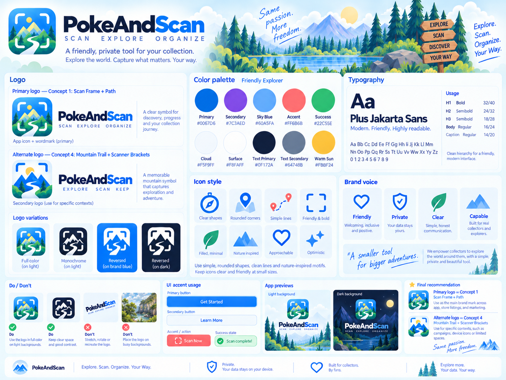

This board consolidates:

- primary and alternate logo;
- color palette;
- typography;
- icon style;
- brand voice;
- do/don’t rules;
- UI accent usage;
- light and dark logo/application previews.

Use it as a convenient one-page brand reference alongside the longer handoff document.

---

# 26. Branding decisions now recommended

## 26.1 Primary logo

**Use Concept 1 — Scan Frame + Path as the main brand mark.**

Recommended uses:
- Android launcher icon;
- splash/loading identity;
- Play Store/app listing;
- settings/about page;
- export/share identity;
- design docs and marketing boards.

### Why Concept 1 wins

It best balances:
- scanning semantics;
- exploration mood;
- small-size legibility;
- originality;
- compatibility with the Friendly Explorer UI language.

## 26.2 Alternate / supporting logo

**Use Concept 4 — Mountain Trail + Scanner Brackets as the alternate brand mark.**

Recommended uses:
- campaign graphics;
- special headers;
- decorative or secondary brand contexts;
- situations where a stronger mountain silhouette is useful.

It should not replace the primary mark across the whole product unless later testing shows a strong advantage.

## 26.3 Wordmark

Wordmark direction:

- dark navy `PokeAnd`
- brighter blue `Scan`
- clean modern sans-serif
- generous spacing in the small tagline line:
  - `SCAN  EXPLORE  ORGANIZE` for concept 1
  - `EXPLORE  SCAN  KEEP` for concept 4

The exact production font can still be platform/system-adjacent if desired, but the styling should remain clean, modern, and highly readable.

---

# 27. App icon implementation guidance

## 27.1 Required icon variants

Prepare at minimum:

1. full-color launcher icon;
2. monochrome icon;
3. dark-background compatible icon;
4. adaptive icon safe composition;
5. small-size optimized export.

## 27.2 Small-size rules

At smaller sizes:
- reduce inner scenic detail;
- preserve the scan brackets;
- keep the main path/river readable;
- preserve clear silhouette contrast between mountains and sky;
- avoid overly thin outlines.

## 27.3 Monochrome rules

Monochrome version should:
- remain recognizable without color;
- preserve the path + mountain structure;
- keep a bold enough bracket shape;
- avoid too many gray layers.

## 27.4 Adaptive icon rules

Ensure:
- safe margins around the main mountain/path symbol;
- no important content clipped by circular/squircle masks;
- background layers remain simple and not overly busy.

---

# 28. Mini brand-pack rules

The mini brand pack indicates the emerging visual grammar.

## 28.1 Typography

The style guide board uses `Plus Jakarta Sans` as a brand-style example.

For production, this can be interpreted in two ways:

### Option A — strict implementation convenience
Use Android system typography for all product UI, and reserve the more branded wordmark style only for:
- app logo;
- marketing/presentation assets.

### Option B — light brand elevation
Use a clean sans family comparable to `Plus Jakarta Sans` in branded materials while keeping the in-app UI functionally Android-native.

**Recommendation:** keep the in-app product UI Android-native for MVP and use the branded feel mainly in logo, illustrations, and presentation assets.

## 28.2 Brand voice

The one-page style guide clarifies the desired tone:

- **Friendly**
- **Private**
- **Clear**
- **Capable**

This should remain the tone for onboarding, settings, review copy, and export messaging.

## 28.3 Do / Don’t

Follow these rules:
- do use the full-color logo on light backgrounds;
- do use monochrome/reversed versions where contrast requires it;
- do keep clear space around the logo;
- do not stretch, rotate, or recreate the logo;
- do not place the logo over busy photography or low-contrast backgrounds.

---

# 29. Updated file inventory in this export pack

## Core documents
- `PokeAndScan_UIUX_Design_Handoff_v0.4.md`
- `README.txt`

## Earlier exploration
- `01_style_comparison_board.png`
- `02_friendly_explorer_foundation_light.png`
- `03_capture_flow_light.png`
- `04_review_library_export_light.png`

## Additional UI boards
- `05_capture_explanation_and_mp4_processing.png`
- `06_recovery_manual_add_settings.png`
- `07_snapshot_detail_and_record_edit.png`

## Dark-theme references
- `08_dark_theme_core_flow.png`
- `09_dark_theme_results_flow.png`

## Illustration / moodboard
- `10_nature_illustration_moodboard.png`

## Earlier brand exploration
- `11_logo_and_app_icon_exploration.png`

## New branding refinement
- `12_logo_refinement_primary_vs_secondary.png`
- `13_app_icon_iterations.png`
- `14_mini_brand_pack_style_guide.png`

## Archive
- `archive_PokeAndScan_UIUX_Brainstorm_v0.1.md`
- `archive_PokeAndScan_UIUX_Design_Handoff_v0.2.md`
- `PokeAndScan_UIUX_Design_Handoff_v0.3.md`

---

# 30. Current final recommendation

The PokeAndScan design system is now mature enough to proceed with:

- UI implementation guidance;
- illustration direction;
- light/dark reference styling;
- and an initial brand system.

## Summary of key decisions

- **Selected UI direction:** Friendly Explorer
- **Primary logo:** Concept 1 — Scan Frame + Path
- **Secondary logo:** Concept 4 — Mountain Trail + Scanner Brackets
- **Main app icon route:** Concept 1 full-color icon
- **Nature/art reference:** use the dedicated illustration moodboard
- **Brand tone:** Friendly, Private, Clear, Capable

The next likely step after this pack would be a **production-ready asset polish pass**:
- final SVG logo/vector cleanup;
- exact launcher-icon exports;
- monochrome system-icon refinement;
- and component-state specs for engineering/design implementation.
